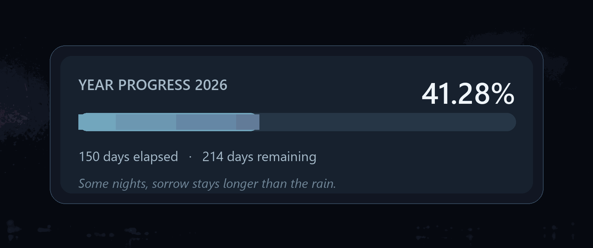
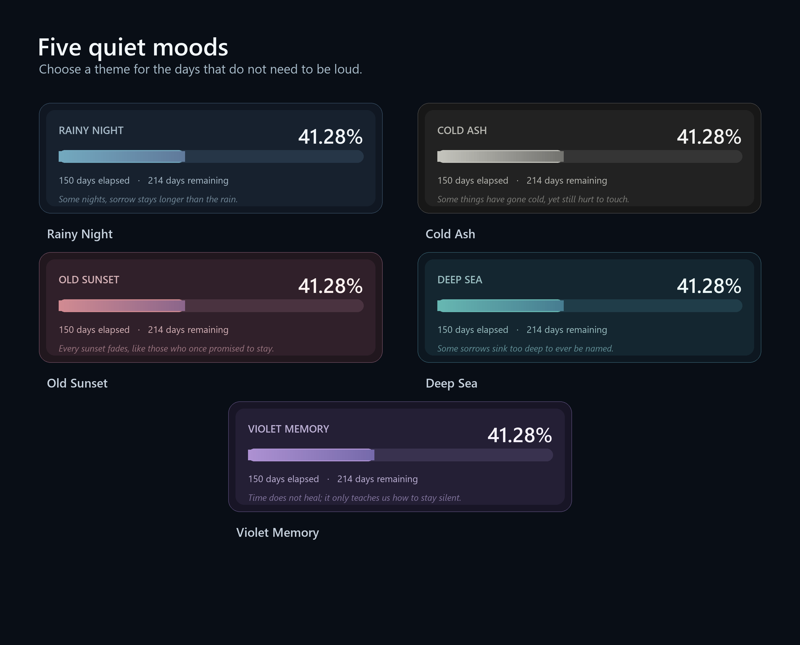
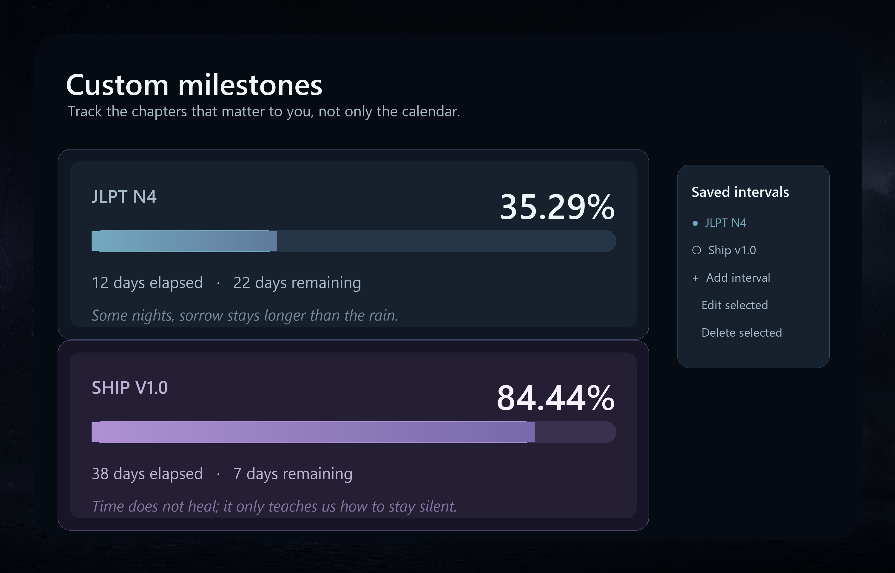

<p align="center">
  
</p>

<h1 align="center">quiet-progress</h1>

<p align="center">
  A quiet Windows desktop widget for watching time pass, one unfinished chapter at a time.
</p>

<p align="center">
  <a href="../../releases/latest/download/quiet-progress.exe">
    
  </a>
</p>

## Features

- Track the year, month, day, or multiple custom milestones.
- Choose between five melancholy themes.
- Switch between Vietnamese, English, and Japanese.
- Drag, resize, and keep the widget floating or at the bottom window layer.
- Control the widget from the system tray.
- Start automatically with Windows.

## Install

1. Download [`quiet-progress.exe`](../../releases/latest/download/quiet-progress.exe).
2. Run `quiet-progress.exe`.

No Python installation is required.

## Themes



## Custom Milestones



## Run From Source

```powershell
python -m pip install -r requirements.txt
python app.py
```

## Build For Windows

```powershell
py -3.14 -m venv .build-venv
.\.build-venv\Scripts\python.exe -m pip install pyinstaller Pillow
powershell -ExecutionPolicy Bypass -File tools\build_windows.ps1
```

The executable is written to `dist/quiet-progress.exe`.

## License

[MIT](LICENSE)
